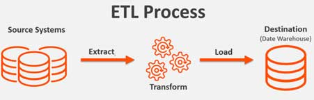

# PySpark ETL and Data Lake
ETL pipeline that uses PySpark to process extracted S3 data, and loads data
 back into S3 as dimensional tables


# Data Preview

## Keyspace Schema

The star schema is used, with a fact table centered around dimension tables
 at its periphery.


### Table Descriptions

**Fact table**: `songplays` -- every occurrence of a song being played is
 stored here.

**Dimension tables**:

* `users` -- the users of the Sparkify music streaming app

* `songs` -- the songs in Sparkify's music catalog

* `artists` -- the artists who record the catalog's songs

* `time` -- the timestamps of records in songplays, broken down into
 specific date and time units (year, day, hour, etc.)

## Introduction
A (fictional) music streaming startup, Sparkify, has grown their user base
 and song database and wants to move their data warehouse to a data lake.
 Their data resides in S3, in a directory of JSON logs on user activity
 on the app, as well as a directory with JSON metadata on the songs
 in their app.

As their data engineer, I built an ETL pipeline that extracts their
 data from S3, processes them using **Spark**, and loads the data back into S3
 as a set of dimensional tables. This empowers their analytics team to
 continue finding insights in what songs their users are listening to.
 Test queries are provided by the Sparkify analytics team
 to compare ETL pipeline results with their expected results.



### Project Tools
Spark API: PySpark
Cloud Services: Amazon Web Services, for Data Lake hosted on S3
 (Simple Storage Service).

Procedure:
* build an ETL pipeline for a data lake
* load data from S3
* process the data into analytics tables using PySpark
* load them back into S3
* deploy this Spark process on a cluster using AWS Redshift

### Project Datasets

two datasets that reside in S3. links:

* Song data:  `s3://udacity-dend/song_data`
* Log data:  `s3://udacity-dend/log_data`

#### Song Dataset
This is a subset of real data from the [Million Song Dataset](https://labrosa.ee.columbia.edu/millionsong/).
Each file is in JSON format and contains metadata about a song and the artist of that song. The files are partitioned
by the first three letters of each song's track ID. For example, here are filepaths to two files in this dataset.

```
song_data/A/B/C/TRABCEI128F424C983.json
song_data/A/A/B/TRAABJL12903CDCF1A.json
```

This is an example of what's in a single song file, `TRAABJL12903CDCF1A.json`.
```JSON
{"num_songs": 1, "artist_id": "ARJIE2Y1187B994AB7", "artist_latitude": null,
 "artist_longitude": null, "artist_location": "", "artist_name": "Line Renaud",
 "song_id": "SOUPIRU12A6D4FA1E1", "title": "Der Kleine Dompfaff", "duration":
 152.92036, "year": 0}
```

#### Log Dataset
This dataset consists of log files in JSON format generated by this
 [event simulator](https://github.com/Interana/eventsim) based on the songs in
  the dataset above.
  These simulate app activity logs from an imaginary music streaming app based
  on configuration settings.

The log files in the dataset are partitioned by year and month.
 For example, here are filepaths to two files in this dataset.

```
log_data/2018/11/2018-11-12-events.json
log_data/2018/11/2018-11-13-events.json
```

### Command Line Run Instructions

1. Clone this repository, which will place the `etl.py` file and the `.cfg` file
 into the same directory.
2. Duplicate the `dl_template.cfg` file to create a new file named `dl.cfg`.
 Because this will contain private login credentials, be sure it is added to the
 `.gitignore` file.
3. Fill in the `[AWS]` attributes from AWS,
 according to the Redshift cluster already created. Please consult
 AWS's well-documented instructions as necessary.
4. Run `python etl.py`. This will copy the 2 large tables from S3 into
 staging tables using PySpark. This also populates the smaller dimension tables.
